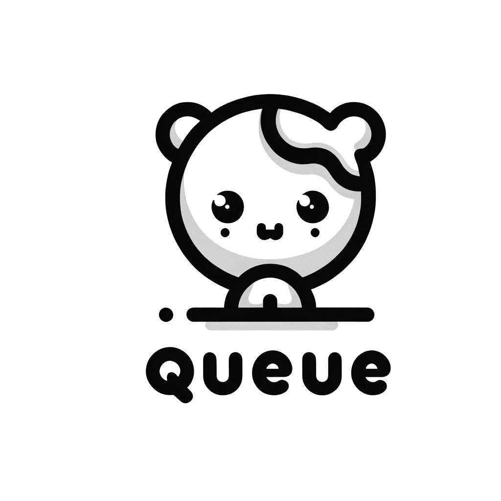

<div align="center">
	<h1>WorkQueue</h1>
	
</div>

# Introduction

WorkQueue is a simple, fast, reliable work queue written in Go. It supports multiple queue types and is designed to be easily extensible which mean you can easily write a new queue type and use it with WorkQueue.

# Queue Types

-   [x] Queue
-   [x] Delaying Queue
-   [x] Priority Queue
-   [x] RateLimiting Queue

# Advantage

-   Simple and easy to use
-   No third-party dependencies
-   High performance
-   Low memory usage
-   Use `quadruple heap`
-   Support action callback functions

# Benchmark

Compare to [kubernetes/client-go](https://github.com/kubernetes/client-go) workqueue, WorkQueue has better performance and lower memory usage.

```bash

```

# Installation

```bash
go get github.com/shengyanli1982/workqueue
```

# Quick Start

Here are some examples of how to use WorkQueue. but you can also refer to the [examples](examples) directory for more examples.

## Queue

`Queue` is a simple queue in project, all queues are based on it. It is a FIFO queue and has `dirty` and `processing` set to track the state of the queue. If you want to `Add` an exist item to the queue, unfortunately, it will not be added to the queue again.

When item is already in the queue, it will be marked as dirty. After you call `Get` method, the item will be marked as processing.

If you not call `Done` method, you want to add the exist item to the queue again, it will not be added to the queue again. `Done` method will remove item from `processing` set, if item in `dirty` set, it will be added to the queue again.

Here is an very important thing to note, if you want to add exist one to the queue again, you must call `Done` method to mark the item as done.

### Methods

-   `Add` adds an item to the workqueue. If the item is already in the queue, it will not be added again.
-   `Get` gets an item from the workqueue. If the workqueue is empty, it will block until an item is added and retrieved.
-   `Done` marks an item as done with the workqueue. If the item is not in the workqueue, it will not be marked as done.
-   `Len` returns the items count of the workqueue.
-   `ShutDown` shuts down the workqueue and waits for all the goroutines to finish.
-   `ShutDownWithDrain` like `ShutDown`, it will drain the workqueue before shutting down.
-   `ShuttingDown` returns true if the workqueue is shutting down.

### Example

```go
package main

import (
	"fmt"

	"github.com/shengyanli1982/workqueue"
)

func main() {
	q := workqueue.NewQueue(nil) // nil, no callback functions

	go func() {
		for {
			item, shutdown := q.Get() // get item from queue
			if shutdown {
				fmt.Println("shutdown")
				return
			}
			fmt.Println("get item:", item)
			q.Done(item) // mark item as done, 'Done' is required after 'Get'
		}
	}()

	q.Add("hello") // add item to queue
	q.Add("world")

	q.ShutDown()
}
```

## Delaying Queue

`Delaying Queue` is a queue that supports delaying execution. It is based on `Queue` and uses a `heap` to maintain the expiration time of the item. When you add an item to the queue, you can specify the delay time, and the item will be executed after the delay time.

### Methods

-   `AddAfter` adds an item to the workqueue after the specified delay time. If the item is already in the queue, it will not be added again.

### Example

```go
package main

import (
	"fmt"

	"github.com/shengyanli1982/workqueue"
)

func main() {
	q := workqueue.NewDelayingQueue(nil)

	go func() {
		for {
			item, shutdown := q.Get()
			if shutdown {
				fmt.Println("shutdown")
				return
			}
			fmt.Println("get item:", item)
			q.Done(item)
		}
	}()

	q.Add("hello")
	q.Add("world")
	q.AddAfter("delay 1 sec", time.Second)
	q.AddAfter("delay 2 sec", time.Second*2)

	q.ShutDown()
}
```

## Priority Queue

`Priority Queue` is a queue that supports priority execution. It is based on `Queue` and uses a `heap` to maintain the priority of the item. When you add an item to the queue, you can specify the priority of the item, and the item will be executed according to the priority.

### Methods

-   `AddWeight` adds an item to the workqueue with the specified priority. If the item is already in the queue, it will not be added again.

### Example

```go
package main

import (
	"fmt"

	"github.com/shengyanli1982/workqueue"
)

func main() {
	q := workqueue.NewPriorityQueue(nil)

	go func() {
		for {
			item, shutdown := q.Get()
			if shutdown {
				fmt.Println("shutdown")
				return
			}
			fmt.Println("get item:", item)
			q.Done(item)
		}
	}()

	q.Add("hello")
	q.Add("world")
	q.AddWeight("priority: 1", 1)
	q.AddWeight("priority: 2", 2)

	q.ShutDown()
}
```

## RateLimiting Queue

`RateLimiting Queue` is a queue that supports rate limiting execution. It is based on `Queue` and uses a `heap` to maintain the expiration time of the item. When you add an item to the queue, you can specify the rate limit of the item, and the item will be executed according to the rate limit.

Oh, I forgot to say, the rate limit is based on the token bucket algorithm. but you can define your own rate limit algorithm by implementing the `RateLimiter` interface.

### Methods

### Example

```go

```

# Features

`WorkQueue` also has interesting properties. It is designed to be easily extensible which mean you can easily write a new queue type and use it with WorkQueue.

## Callback

`WorkQueue` supports action callback function. Specify a callback functions when create a queue, and the callback function will be called when do some action.

Callback functions is not required that you can use `WorkQueue` without callback functions. Set `nil` when create a queue, and the callback function will not be called.

### Example

```go
package main

import (
	"fmt"

	"github.com/shengyanli1982/workqueue"
)

type callback struct {}

func (c *callback) OnAdd(item interface{}) { // OnAdd will be called when add an item to the queue
	fmt.Println("add item:", item)
}

func (c *callback) OnGet(item interface{}) { // OnGet will be called when get an item from the queue
	fmt.Println("get item:", item)
}

func (c *callback) OnDone(item interface{}) { // OnDone will be called when done an item from the queue
	fmt.Println("done item:", item)
}

func main() {
	q := workqueue.NewQueue(&callback{}) // set callback functions

	go func() {
		for {
			item, shutdown := q.Get()
			if shutdown {
				fmt.Println("shutdown")
				return
			}
			q.Done(item)
		}
	}()

	q.Add("hello")
	q.Add("world")

	q.ShutDown()
}
```

### Reference

The queue callback functions are loosely used and can be easily extended, you can use it as you like.

#### Queue

-   `OnAdd` will be called when add an item to the queue
-   `OnGet` will be called when get an item from the queue
-   `OnDone` will be called when done an item from the queue

#### Delaying Queue

-   `OnAfter` will be called when add an specified delay time item to the delaying queue

#### Priority Queue

-   `OnWeight` will be called when add an specified priority item to the priority queue

# Thanks to

-   [kubernetes/client-go](https://github.com/kubernetes/client-go)
-   [lxzan/memorycache](https://github.com/lxzan/memorycache)
